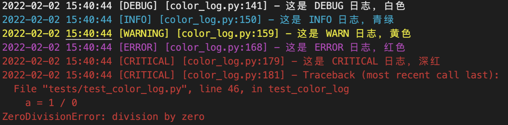

# py-color-log

> python 彩色日志

------

## 运行环境


## 介绍

封装了 colorlog 使其更易用，效果如图：



其特点为：

- 默认的各等级颜色分配
- 默认的日志滚动配置（按天滚动，最多保留 7 天）
- 默认的第三方日志禁用：
    - `requests`
    - `chardet.charsetprober`
- 灵活可控的配置


## 安装说明

执行脚本： 

```
python -m pip install --upgrade pip
python -m pip install py-color-log
```


## 使用说明

在代码中引入 py-color-log 包即可：

```python
from color_log.clog import log

log.debug('这是 DEBUG 日志，白色')
log.info('这是 INFO 日志，青绿')
log.warn('这是 WARN 日志，黄色')
log.error('这是 ERROR 日志，紫色')
try :
    a = 1 / 0
except :
    log.critical('这是 CRITICAL 日志，红色')
```

可以通过构造函数调整日志配置：

```python
from color_log.clog import ColorLog

'''
[param] log_dir: 日志输出目录
[param] app_logs: 应用运行日志的名称字典，格式如 { name: min_level, ... }
[param] logfile_format: 输出日志文件的格式
[param] date_format: 输出日志文件的时间格式
[param] logcolors: 日志每个等级的颜色字典，格式如 { level: color, ... }
[param] rollday: 日志滚动间隔（单位：天）
[param] backupdays: 备份日志时长（单位：天）
[param] encoding: 日志编码
[param] debug: 是否打印 debug 日志
[param] thirdlist: 禁用的第三方日志列表
'''
log = ColorLog(
    log_dir = './logs', 
    app_logs = {
        'run.log': logging.INFO, 
        'err.log': logging.ERROR
    }, 
    logfile_format = '%(asctime)s [%(levelname)s] [%(filename)s:%(lineno)d] - %(message)s', 
    date_format = '%Y-%m-%d %H:%M:%S', 
    log_colors = {
        'DEBUG': 'white',
        'INFO': 'cyan',
        'WARNING': 'yellow',
        'ERROR': 'purple',
        'CRITICAL': 'red',
    }, 
    rollday = 1, 
    backupdays = 7, 
    encoding = 'utf-8', 
    debug = True, 
    thirdlist = [ 
        'requests', 
        'chardet.charsetprober'
    ]
)
```
